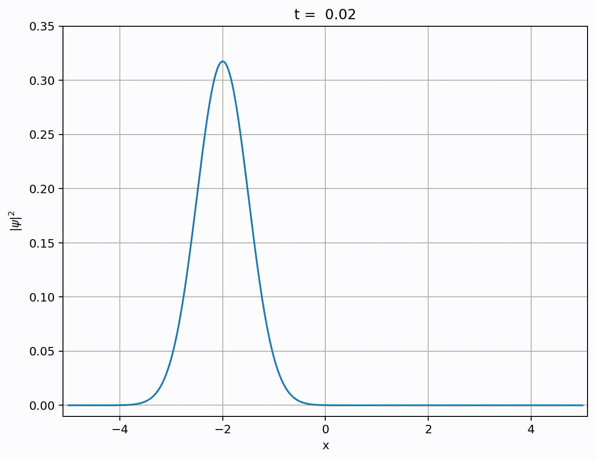

# Solving Time-Dependent Schrödinger Equations in Python

## Introduction

Any quantum mechanical system evolves according to the TDSE given below
```math
\frac{\partial}{\partial t} \left| \psi (t) \right> = - i H (t) \left| \psi (t) \right>
```
[^medium]: Based on this [article](https://medium.com/intuition/solve-the-time-dependent-schr%C3%B6dinger-equation-in-less-than-12-lines-of-python-3663077b1fbd) by Mathcube


