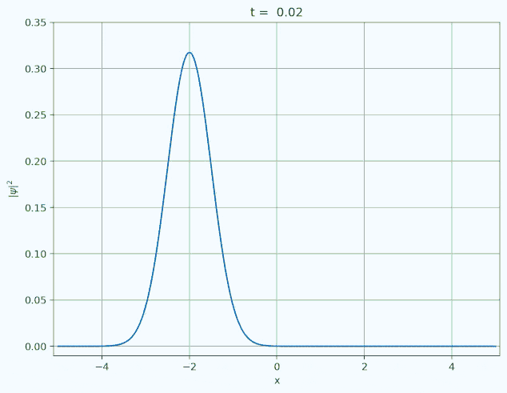

# Solving Time-Dependent Schrödinger Equations in Python

## Introduction
Based on [this article](https://medium.com/intuition/solve-the-time-dependent-schr%C3%B6dinger-equation-in-less-than-12-lines-of-python-3663077b1fbd) by Mathcube

Any quantum mechanical system evolves according to the TDSE given below
```math
\frac{\partial}{\partial t} \left| \psi (t) \right> = - i H (t) \left| \psi (t) \right>
```
To simulate this emulation, we need to solve this differential equation. We can use the Euler Approximation (1<sup>st</sup> Order approximation) by discretizing the time domain. The differential equation is then approximated in the forward direction by
```math
\frac{\left| \psi \right>^{(n+1)} - \left| \psi \right>^{(n)}}{\Delta t} = -i H \left| \psi \right>^{(n)} 
``` 
where
```math
\left| \psi \right>^{(n)} = \left| \psi (n \Delta t) \right>
```

This gives us the Explicit form of the wave-function at the next time step.
```math
\left| \psi \right>^{(n+1)} = (1 - i H \Delta t) \left| \psi \right>^{(n)}
```
Similarly for the backward approximation
```math
\frac{\left| \psi \right>^{(n+1)} - \left| \psi \right>^{(n)}}{\Delta t} = -i H \left| \psi \right>^{(n+1)} 
``` 
we get the implicit form
```math
(1 + i H \Delta t) \left| \psi \right>^{(n+1)} =  \left| \psi \right>^{(n)}
```
But in these approximation, we lose the normalization of the wave-function.

## Crank–Nicolson Scheme

To combat the issue of loss of normalization, we can take the average of the implicit and explicit forms given above to get
```math
\left( 1 + \frac{i\Delta t}{2} H \right) \left| \psi \right>^{(n+1)} = \left( 1 - \frac{i\Delta t}{2} H \right) \left| \psi \right>^{(n)}
```
which defines a unitary transformation
```math
U(t) = \left( 1 + \frac{i\Delta t}{2} H(t) \right)^{-1} \cdot \left( 1 - \frac{i\Delta t}{2} H(t) \right)

```
This can then be used to approximate the evolution of the system.

## Results
The Crank-Nicolson scheme was implemented in python and the evolution of a gaussian wave-packet in harmonic potential simulated.


## Notes
The python script outputs a series of ordered JPEG images, which were later stitched using ffmpeg.
```
ffmpeg -f image2 -framerate 12 -i %03d.jpg Solution.gif
```